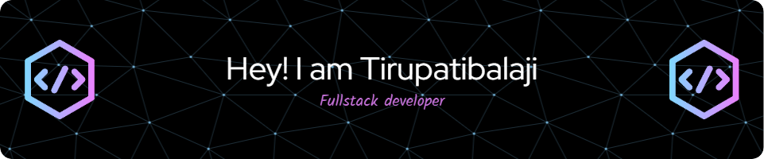

### Hi there 👋

# 💫About Me :
- 🔭 I’m currently working on DTS Mod
- 🌱 I’m currently learning Read Redux
- 💬 Ask me about React Js
- 📫 How to reach me: contact@thedtsdevelopment.xyz
- 😄 Pronouns: Tirupatibalaji
- ⚡ Fun fact: I love Freelancing

## 🌐Socials
    

# 💻Tech Stack
                                    	    
# 📊GitHub Stats :
 
 

---

  ## 💰You can help me by Donating
   

  <!-- Proudly created with GPRM ( https://gprm.itsvg.in ) -->
  
